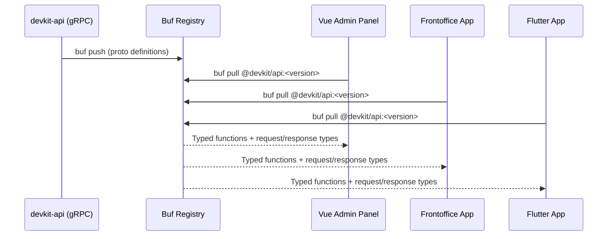
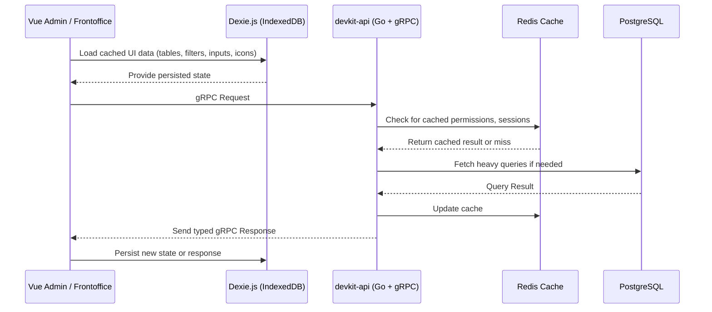

# Philosophy & Goals

DevKit is designed to eliminate the repetitive pain of building full-stack applications — especially admin panels — by combining code generation, schema-first development, type-safe customization, and built-in caching across the stack. It empowers developers to ship faster without compromising flexibility or maintainability.

## Core Philosophy

### 🛠 Code Generation Over Abstraction

DevKit prefers generating readable, real code over hiding logic behind deep abstraction layers. From APIs to admin features, the CLI scaffolds your codebase with explicit files and types you can fully control.

### 🔁 Schema-Driven UI

Admin panels are repetitive. Every app has:

- Login, logout, and password recovery flows
- A dashboard overview
- CRUD for each feature: create, read, update, soft delete, restore, hard delete, list

Instead of writing HTML and CSS for every table, form, and modal, DevKit allows you to define a type-safe schema that automatically generates the entire interface — while remaining fully customizable.

### 🔧 Customization Without Limits

Every DevKit component is built with scoped slots and internal state exposure. This means:

- You can override any part of a form, table, or action
- You can dynamically modify behavior without touching core logic
- You get full flexibility without sacrificing maintainability

### 💡 Explicit by Default

Generated code is verbose by design. DevKit emphasizes readability and clarity, avoiding magic decorators or runtime guessing. What you see is exactly what you get — and you can trace every line.

### 🧩 Modular Design

All DevKit packages are composable:

- `@devkit/form` – FormKit abstraction with validation
- `@devkit/datalist` – Data tables with filters and actions
- `@devkit/filemanager` – Upload and manage media via buckets
- `@devkit/base-components` – Reusable UI primitives
- `@devkit/api-client` – Typed SDK for gRPC and REST
- `@devkit/config` – Shared Tailwind, TS, and aliases
- `@devkit/admin` – Full admin shell

You can use these independently or together — the default `@devkit/admin` package stitches everything into a complete admin interface.

### 🧬 Type Safety Across the Stack

Thanks to generic Vue 3 components, DevKit offers:

- Compile-time safety for table columns, filters, and form inputs
- Automatic type propagation from your gRPC backend
- Component-level validation and IDE support

When you change a type on the backend, the UI will reflect the change — or throw a type error if you forget to update something. This ensures correctness without manual syncing.



<!-- <AppIcon icon='typesafety-graph' class="custom-icon w-full bg-white" /> -->

## Full-Stack Caching

DevKit uses intelligent caching to improve responsiveness and scalability — both on the backend and frontend:

- **Backend:** Redis is used to cache heavy queries, computed permissions, and user session data. This reduces database load and speeds up response times.
- **Frontend:** Dexie.js powers a lightweight IndexedDB cache for Vue stores, allowing fast page reloads, offline usage, and persistent filters or table states.

Both layers communicate through defined cache keys and timestamps, ensuring cache invalidation is predictable and schema-aware.



## Example: Schema-Driven Admin Feature

A user feature typically includes:

- UserList (with filters, actions, and pagination)
- UserForm (create/update)
- CRUD API (gRPC or REST)

In DevKit, defining a shared schema drives the entire stack:

```vue
<script setup lang="ts">
import "@devkitvue/datalist/style.css";
import {
  DataList,
  type DatalistProps,
  ColumnText,
  ColumnDate,
} from "@devkitvue/datalist";
import type {
  UserListRow,
  UserListRequest,
} from "@buf/ahmeddarwish_devkit-api.bufbuild_es/devkit/v1/accounts_user_pb";
const userListProps: DatalistProps<
  typeof apiClient,
  UserListRequest,
  UserListRow
> = {
  context: {
    datalistKey: "user",
    rowIdentifier: "userId",
    records: "userList",
    columns: {
      userId: new ColumnText("userId"),
      userName: new ColumnText("userName"),
      userEmail: new ColumnText("userEmail"),
      createdAt: new ColumnDate("createdAt"),
    },
    filters: [
      {
        isGlobal: true,
        matchMode: "contains",
        input: {
          $formkit: "text",
          prefixIcon: "user-line",
          name: "userName",
          label: "userName",
        },
      },
    ],
    options: {
      title: "user_title",
      description: "user_description",
    },
  },
};
</script>
<template>
  <Suspense>
    <DataList v-bind="userListProps" />
  </Suspense>
</template>
```

<script setup lang="ts">
import '@devkitvue/datalist/style.css'
import { DataList, type DatalistProps , ColumnText , ColumnDate } from "@devkitvue/datalist";
import type {
UserListRow,
UserListRequest,
} from "@buf/ahmeddarwish_devkit-api.bufbuild_es/devkit/v1/accounts_user_pb";
const userListProps: DatalistProps<typeof apiClient, UserListRequest, UserListRow> = {
context : {
datalistKey: "user",
rowIdentifier: "userId",
records: 'userList',
columns: {
userId: new ColumnText("userId"),
userName: new ColumnText("userName"),
userEmail: new ColumnText("userEmail"),
createdAt: new ColumnDate("createdAt"),
},
filters: [
{
isGlobal: true,
matchMode: "contains",
input: { 
$formkit: "text",
prefixIcon: "user-line",  
name: "userName",
label: "userName",
},
}],
options: {
title: "user_title",
description: "user_description",
},
}
}

</script>
<LoginForm />
<Suspense>
    <DataList
        v-bind="userListProps"
    />
</Suspense>
This reduces repetitive markup while preserving full control through scoped slots and schema overrides.
